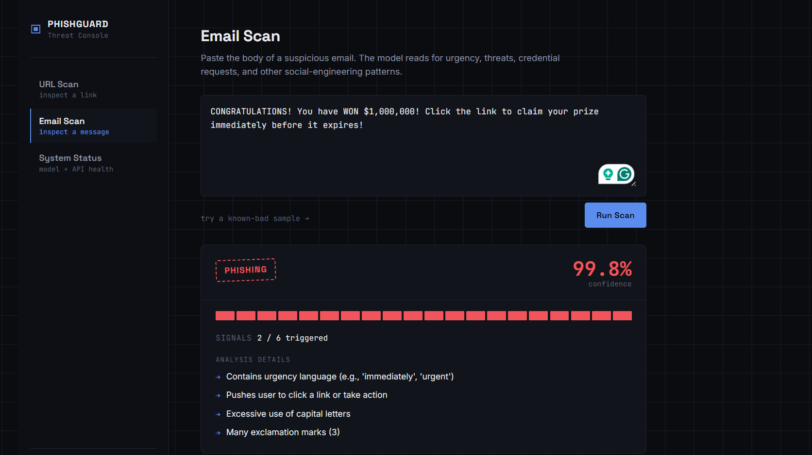
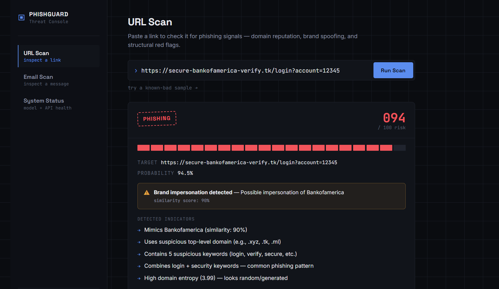
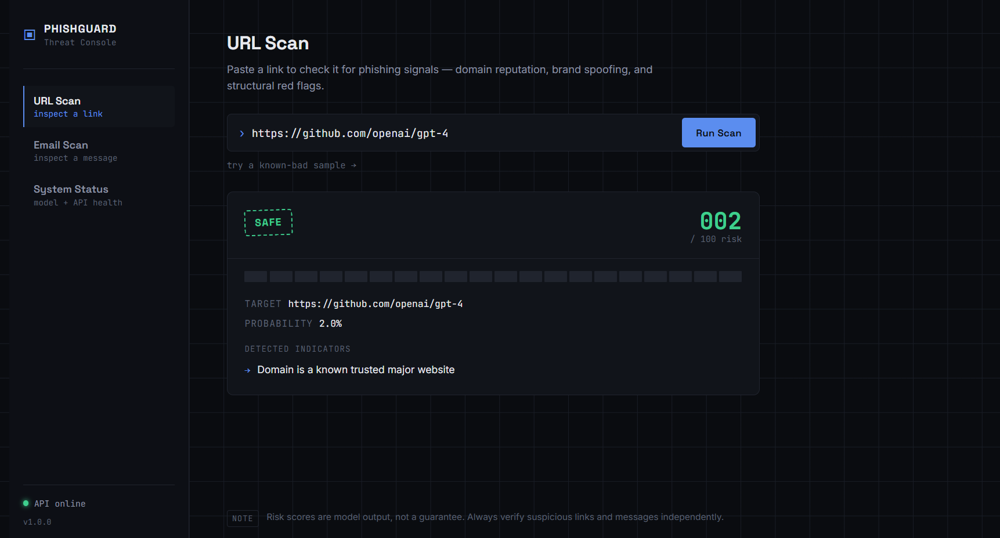
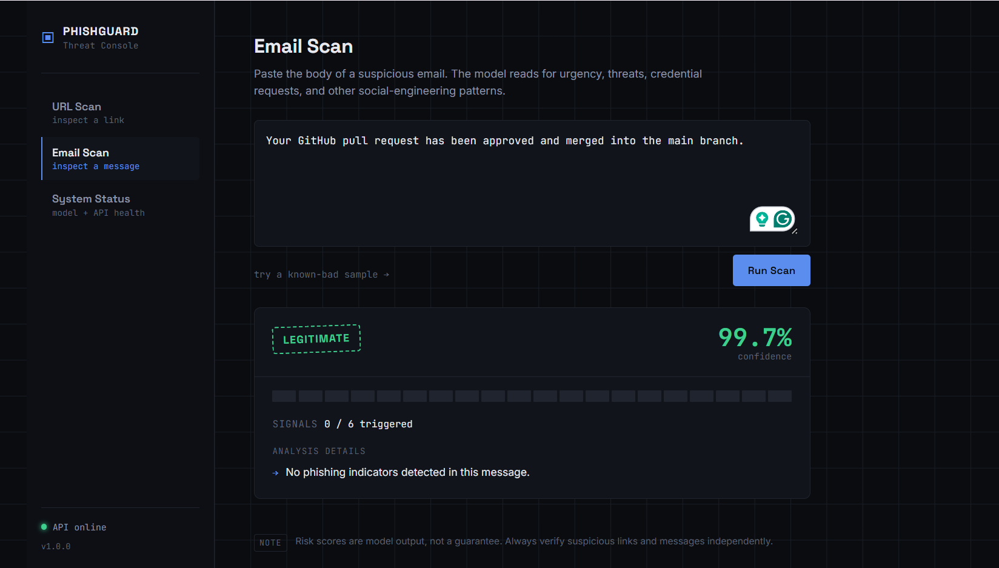
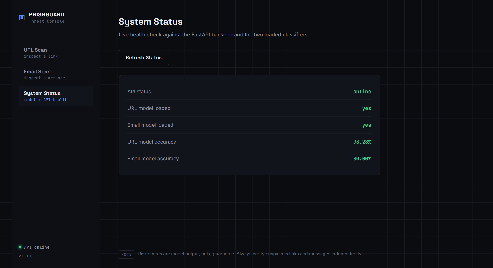

# PhishGuard

**AI-powered phishing detection for URLs and emails — FastAPI backend, scikit-learn classifiers, a browser extension, and a web dashboard.**

[](https://www.python.org/)
[](https://fastapi.tiangolo.com/)
[](https://scikit-learn.org/)
[](#model-performance)
[](#model-performance)
[](#license)

PhishGuard inspects URLs and email text for phishing indicators and returns an explainable risk score — not just a yes/no label. A Random Forest classifier scores URLs on 37 lexical/structural features (entropy, suspicious TLDs, brand-name similarity, IP-literal hosts, and more); a separate NLP classifier scores email text for social-engineering patterns (urgency, threats, credential requests). Both are exposed through a FastAPI service and consumed by a Chrome extension and a standalone web dashboard.

---

## Table of contents

- [Features](#features)
- [Screenshots](#screenshots)
- [Architecture](#architecture)
- [Project structure](#project-structure)
- [Getting started](#getting-started)
  - [Prerequisites](#prerequisites)
  - [Backend setup](#backend-setup)
  - [Web dashboard](#web-dashboard)
  - [Browser extension](#browser-extension)
  - [Docker](#docker)
- [API reference](#api-reference)
- [How scoring works](#how-scoring-works)
- [Model performance](#model-performance)
- [Known limitations](#known-limitations)
- [Roadmap](#roadmap)
- [Tech stack](#tech-stack)
- [License](#license)

---

## Features

- **URL risk scoring** — 37 engineered features covering URL length, entropy, suspicious TLDs, IP-literal hosts, keyword stuffing, and subdomain structure
- **Brand impersonation detection** — Levenshtein-distance and substring matching against a known-brand list (`paypal`, `amazon`, `microsoft`, major banks, etc.), with exact-match domains correctly excluded from false-flagging
- **Email phishing classifier** — NLP feature extraction for urgency language, threats, action prompts, financial content, and sensitive-data requests
- **Explainable output** — every verdict ships with a human-readable list of the specific signals that drove it, not just a label
- **Trusted-domain short-circuit** — a whitelist of major platforms (Google, GitHub, Microsoft, etc.) bypasses scoring entirely to avoid wasted compute and false positives on traffic you already trust
- **Browser extension (Manifest V3)** — scans every page on navigation, shows a toolbar badge, and blocks high-risk pages with an in-page warning overlay
- **Web dashboard** — manual URL/email scanning with a live system-status panel
- **Offline-safe** — domain parsing uses a bundled public-suffix-list snapshot, so it doesn't depend on a live network call to function

---

## Screenshots

**A phishing email, flagged with its actual signals.** This one was a classic prize-scam template — the model picked up the urgency language, the call to action, the all-caps shouting, and the exclamation-mark spam, and landed on 99.8% confidence.



**A spoofed Bank of America login page.** The URL uses a `.tk` domain and the word "secure," but what actually pushes this one over the edge is the brand-impersonation check — the domain scores 90% similarity to "bankofamerica," which gets called out as its own warning box instead of just being buried in the indicator list.



**A legitimate GitHub URL, correctly left alone.** This is the trusted-domain whitelist doing its job — instead of running the full model and risking a false positive on a well-known domain, it short-circuits straight to a 2/100 risk score with a one-line explanation.



**A normal work email, correctly read as harmless.** No urgency, no threats, no link-bait — zero of the six phishing signals fire, and the dashboard says so plainly instead of forcing a score where there isn't one.



**The system status panel**, for when you just want to confirm both classifiers actually loaded and the API is reachable before you start scanning anything.



---

## Architecture

The Chrome extension and the web dashboard are both thin clients — they don't do any scoring themselves. Both send the URL or email text to the FastAPI backend over a plain HTTP POST request. The backend runs it through the relevant feature extractor (`url_features.py` or `email_features.py`), passes those features into the matching scikit-learn model (Random Forest for URLs, Logistic Regression for emails), and turns the model's output into a risk score plus a plain-English list of reasons. That response goes straight back to whichever client asked for it — the extension renders it as a toolbar badge and warning overlay, the dashboard renders it as a scan readout.

There's no database and no background job queue. Every scan is stateless: request in, score out.

---

## Project structure

```
phishing-detector/
├── backend/
│   ├── features/
│   │   ├── url_features.py        # URL feature extraction + brand-impersonation matching
│   │   └── email_features.py      # NLP feature extraction for email text
│   ├── api.py                     # FastAPI application
│   ├── train.py                   # Model training script
│   └── requirements.txt
├── models/
│   ├── url_classifier.pkl         # Random Forest, trained on 226K balanced URLs
│   ├── email_classifier.pkl       # Logistic Regression
│   ├── url_model_meta.json
│   └── email_model_meta.json
├── frontend/
│   ├── index.html                 # Web dashboard
│   ├── styles.css
│   ├── script.js
│   └── server.py                  # Lightweight static file server
├── extension/
│   ├── manifest.json              # Chrome Extension, Manifest V3
│   ├── background.js              # Service worker — scans on navigation
│   ├── content.js                 # In-page warning overlay
│   ├── popup/
│   └── icons/
├── docs/
│   └── screenshots/
├── test_system.py                 # Smoke test for feature extraction + model loading
├── Dockerfile
├── start.sh / start.bat
└── README.md
```

---

## Getting started

### Prerequisites

- Python 3.11+
- `pip`
- Google Chrome or another Chromium-based browser (for the extension, optional)

### Backend setup

```bash
cd backend
python3 -m venv venv

# macOS / Linux
source venv/bin/activate
# Windows
venv\Scripts\activate

pip install -r requirements.txt
python api.py
```

The API starts on `http://localhost:8000`. Interactive Swagger docs are available at `http://localhost:8000/docs`.

Verify it's healthy:
```bash
curl http://localhost:8000/health
```
```json
{"status":"ok","url_model":true,"email_model":true,"url_model_accuracy":0.9328,"email_model_accuracy":1.0}
```

> Pretrained models are shipped in `models/`. To retrain from scratch, see [`backend/train.py`](backend/train.py) — the URL model expects a labeled CSV at `data/urls_raw.csv` (not included; see [Roadmap](#roadmap)).

### Web dashboard

In a second terminal, with the backend already running:

```bash
cd frontend
python server.py
```

Open `http://localhost:8080`.

### Browser extension

1. Open `chrome://extensions/`
2. Enable **Developer mode** (top right)
3. Click **Load unpacked**
4. Select the `extension/` folder
5. With the backend running, navigate to any page — the toolbar badge updates automatically, and high-risk pages (score ≥ 75) trigger an in-page warning

### Docker

```bash
docker build -t phishguard .
docker run -p 8000:8000 phishguard
```

This containerizes the backend only. The frontend and extension still point at `http://localhost:8000` by default — update `API_URL` / `API_BASE` in `frontend/script.js` and `extension/background.js` if you deploy the API elsewhere.

---

## API reference

### `POST /scan-url`

```json
// Request
{ "url": "https://amaz0n-login-verification.xyz" }

// Response
{
  "url": "https://amaz0n-login-verification.xyz",
  "risk_score": 79,
  "classification": "phishing",
  "phishing_probability": 0.7918,
  "reasons": [
    "Uses suspicious top-level domain (e.g., .xyz, .tk, .ml)",
    "Contains suspicious keyword (login, verify, secure, etc.)",
    "High domain entropy (4.05) — looks random/generated"
  ],
  "brand_impersonation": null,
  "features": { "...": "37 numeric features" }
}
```

### `POST /scan-email`

```json
// Request
{ "text": "Your account will be SUSPENDED immediately. Click here NOW to verify your password!" }

// Response
{
  "classification": "phishing",
  "confidence": 99.6,
  "phishing_probability": 0.9959,
  "reasons": [
    "Contains urgency language (e.g., 'immediately', 'urgent')",
    "Contains threats (e.g., 'account suspended', 'terminated')",
    "Pushes user to click a link or take action",
    "Requests sensitive data (password, SSN, etc.)"
  ],
  "signal_count": 4
}
```

> `confidence` is already on a 0–100 scale — don't multiply it by 100 again client-side.

### `GET /health`

```json
{
  "status": "ok",
  "url_model": true,
  "email_model": true,
  "url_model_accuracy": 0.9328,
  "email_model_accuracy": 1.0
}
```

---

## How scoring works

| Stage | What happens |
|---|---|
| 1. Trusted-domain check | If the host matches a hardcoded whitelist of major platforms, return `safe` immediately without running the model |
| 2. Feature extraction | URL → 37 numeric features (entropy, keyword counts, TLD, brand similarity, etc.) via `url_features.py`. Email → NLP signal counts via `email_features.py` |
| 3. Classification | Random Forest (URL) or Logistic Regression (email) produces a phishing probability |
| 4. Risk banding | `< 0.4` → safe · `0.4–0.69` → suspicious · `≥ 0.7` → phishing |
| 5. Explanation | Feature values are translated into a human-readable reasons list — this is computed independently of the model, directly from the extracted features |

Brand impersonation is scored separately: domain names are compared against a known-brand list using direct substring matching and Levenshtein distance, with an exact domain-to-brand match excluded so legitimate regional/business domains aren't self-flagged.

---

## Model performance

### URL classifier — Random Forest, 226K balanced samples

```
              precision    recall  f1-score
       Legit       0.95      0.94      0.95
    Phishing       0.89      0.91      0.90

    accuracy                           0.93
    ROC-AUC                            0.979
```

**Top predictive features:** `tld_length`, `has_php_extension`, `path_length`, `num_hyphens`, `path_entropy`

### Email classifier — Logistic Regression

Trained on a small synthetic set of 40 labeled examples (20 phishing / 20 legitimate). Reports 100% accuracy on its own held-out split, but that figure should be read with caution — see [Known limitations](#known-limitations).

---

## Known limitations

- **Email model dataset is small and synthetic.** The shipped classifier is trained on 40 hand-written examples, not a real-world corpus. It generalizes reasonably to obvious phishing language but should not be presented as production-grade. Swapping in a real labeled dataset (e.g. Enron + a public phishing-email corpus) is the highest-impact next step.
- **URL shorteners score high by default.** Services like `bit.ly` structurally resemble high-entropy, low-information domains, which the model interprets as suspicious. There's no shortener-specific whitelist or redirect-resolution step yet.
- **No live domain reputation signals.** WHOIS/domain-age, DNS records, and blacklist lookups are not currently implemented, despite `python-whois` being listed as a dependency.
- **Brand list is fixed.** Impersonation detection only covers the ~30 brands hardcoded in `KNOWN_BRANDS` — anything outside that list won't trigger a brand-impersonation flag, even if the underlying ML model still scores the URL as risky on its other features.

---

## Roadmap

- [ ] Replace the synthetic email dataset with a real corpus (Enron + public phishing-email dataset) and retrain
- [ ] WHOIS / domain-age lookup as a scoring input
- [ ] DNS record and blacklist checks
- [ ] URL-shortener detection with redirect resolution before scoring
- [ ] Screenshot-based visual similarity / fake-logo detection
- [ ] BERT/DistilBERT email classifier as a drop-in replacement for the logistic regression baseline
- [ ] Scan-history dashboard with persistent storage
- [ ] CI pipeline (lint + `test_system.py`) on push

---

## Tech stack

| Layer | Tools |
|---|---|
| Backend | FastAPI, Uvicorn, Pydantic |
| ML | scikit-learn (Random Forest, Logistic Regression), imbalanced-learn (SMOTE), pandas, NumPy |
| URL parsing | tldextract (offline public-suffix snapshot) |
| Frontend | Vanilla HTML/CSS/JS, no build step |
| Browser extension | Chrome Manifest V3, Service Workers |
| Deployment | Docker |

---

## Author

Disha Grover

B.Tech Student | Cybersecurity & AI Enthusiast

Feel free to explore the project, raise issues, or suggest improvements.